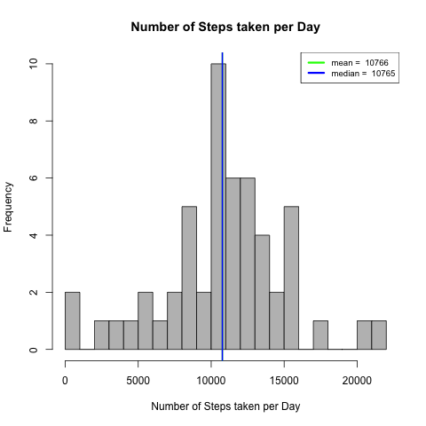
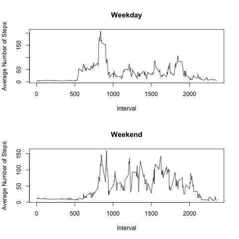

# "Reproducible Research: Peer Assessment 1"

##### Report for Reproducible Research: Peer Assessment 1

This reports details how the plots in this folder were created

* `Plot1.png` - Histogram of number of steps taken per Day
* `Plot2.png` - Average Number of steps Taken by interval
* `Plot3.png` - Histogram of number of steps taken per Day after Imputing missing values
* `Plot4.png` - Plot to compare average number of steps taken during weekdays vs weekends

## Loading and preprocessing the data

* Read data from csv file. Using option `header=T`
```r
activity <- read.csv("activity.csv", header = T)
```

## Histogram of number of steps taken per Day

#### Use dplyr to find the total number of steps per day

```r
library(dplyr)

date_activity <- activity %>% 
  group_by(date) %>% 
    summarise(No_of_steps = sum(steps))
```

#### Plot histogram

Open a png file `plot1.png` and plot the histogram.

```r
png("plot1.png")
hist(date_activity$No_of_steps, 
     breaks = 25, 
     col = "grey", 
     main = "Number of Steps taken per Day",
     xlab = "Number of Steps taken per Day")
```

#### Calculate mean and median

Using the mean and median functions the mean and median number of steps taken per day is calculated

```r
mean_no_of_steps <- mean(date_activity$No_of_steps, na.rm = T)
median_no_of_steps <- median(date_activity$No_of_steps, na.rm = T)
```

**Mean = 10766** <br>
**Median = 10765** <br>
#### Plot abline for mean and median

Abline is used to show mean and median in the histogram

```r

abline(v = mean_no_of_steps, col = "green", lwd = 2)
abline(v = median_no_of_steps, col = "blue
```

Adding a legend to the plot

```r
ab_legend <- c(paste("mean = ", round(mean_no_of_steps), collapse = ""), 
               paste("median = ",round(median_no_of_steps), collapse = ""))
legend("topright", 
       lwd = 3, 
       lty = 1, 
       legend = ab_legend, 
       col = c("green","blue"),
       cex = .8
       )
```

#### Turn of Graphical device

```r
dev.off()
```

##### Plot


## What is the average daily activity pattern?

#### Calculating mean of each interval across the dates

Using dplyr the means of the intervals are calculated across the dates.

```r
intreval_activity <- activity %>% 
  group_by(interval) %>% 
  summarise(avg_no_of_steps = mean(steps, na.rm = T))

dim(intreval_activity)
head(intreval_activity)
```
#### Plotting the means

A file `plot2.png` is opened and a plot of Average number of steps vs interval is made.
```r
png("plot2.png")
plot(x = intreval_activity$interval, 
     y = intreval_activity$avg_no_of_steps,   
     type = "l", 
     xlab = "Interval", 
     ylab = "Average Number of Steps Taken",
     main = "Average Number of Steps Taken by Interval", 
     )
```


####Find the 5-minute interval that, on average, contains the maximum number of steps, and add an abline

```
max_number_steps  <-  max(intreval_activity$avg_no_of_steps)
interval_max_steps <- intreval_activity[
  which(intreval_activity$avg_no_of_steps == max_number_steps),"interval"]
abline(v = interval_max_steps, col = "green", lwd = 3)

dev.off()
```

##### Plot


## Calculating the number of `NA` values

```r
sum(is.na(activity$steps))
```

There are `2304` `NA` values.

## Imputing Missing Data and plot new histogram

The average by interval across the dates is used to fill the `NA` values.

```r
tmp_1 <- merge(activity[is.na(activity$steps),], intreval_activity, by = "interval")
activity[is.na(activity$steps),"steps"] <- tmp_1[,"steps"]
```

#### Use dplyr to find the total number of steps per day
```r
date_activity <- activity %>% 
  group_by(date) %>% 
  summarise(No_of_steps = sum(steps))
```
#### Plot Histogram

```r
png("plot3.png")
hist(date_activity$No_of_steps, 
     breaks = 25, 
     col = "grey", 
     main = "Number of Steps taken per Day",
     xlab = "Number of Steps taken per Day")
```
#####Calculate mean and median
```r
mean_no_of_steps <- mean(date_activity$No_of_steps, na.rm = T)
median_no_of_steps <- median(date_activity$No_of_steps, na.rm = T)
```

**Mean = 10766** <br>
**Median = 10765** <br>

#####Add abline for mean and median
```r
abline(v = mean_no_of_steps, col = "green", lwd = 2)
abline(v = median_no_of_steps, col = "blue", lwd = 2)

ab_legend <- c(paste("mean = ", round(mean_no_of_steps), collapse = ""), 
               paste("median = ",round(median_no_of_steps), collapse = ""))
legend("topright", 
       lwd = 3, 
       lty = 1, 
       legend = ab_legend, 
       col = c("green","blue"),
       cex = .8
)

dev.off()
```

##### Plot


## Plot to compare Average number of steps between weekends and weekdays

Covert time format and obtain weekday for all dates
```r
activity$date <- strptime(x = activity$date, "%Y-%m-%d")
head(activity)

activity$weekday <- weekdays(activity$date)
```

Determine if the weekday is a weekend and add a new column to specify it
```r
weekend <- function(x) {
  ifelse(any(x == c("Sunday","Saturday")), 
         return("Weekend"),
         return("Weekday"))
}

tmp <- sapply(activity$weekday, weekend)
activity$daytype <- tmp
```

Use Dplyr to find the average number of steps when grouped by interval.
```r
intreval_activity_weekend <- activity[which(activity$daytype=="Weekend"),-2] %>% 
  group_by(interval) %>% 
  summarise(avg_no_of_steps = mean(steps, na.rm = T))


intreval_activity_weekday <- activity[which(activity$daytype=="Weekday"),-2] %>% 
  group_by(interval) %>% 
  summarise(avg_no_of_steps = mean(steps, na.rm = T))

png("plot4.png")
par(mfrow = c(2, 1))
```


Create a new plot to compare between weekdays and weekends
```r
plot(intreval_activity_weekday,
     type = "l", 
     main = "Weekday", 
     ylab = "Average Number of Steps")
plot(intreval_activity_weekend, 
     type = "l", 
     main = "Weekend",
     ylab = "Average Number of Steps")

dev.off()
```

##### Plot

